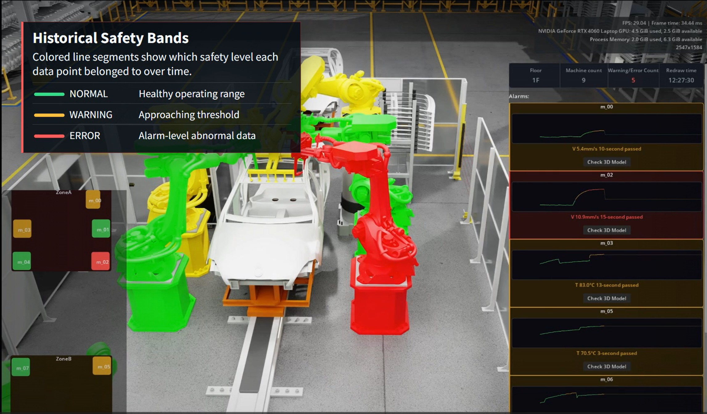

# Factory Floor Digital Twin

Factory Floor Digital Twin 是一個以 NVIDIA Omniverse Kit 呈現的工廠數位分身 Demo。系統會從 ROS2 產生模擬機台資料，透過 MQTT 傳遞到 Omniverse extension，最後在 USD factory scene 中更新機台狀態、顏色、HUD、告警列表、小地圖與機台標籤。

## Demo video
[](https://youtu.be/GCUeru59X_M)

[Watch the full demo on YouTube](https://youtu.be/GCUeru59X_M)

## Demo 場景資產

本專案直接使用 NVIDIA Omniverse 官方的 [USD Explorer Sample Assets Pack](https://docs.omniverse.nvidia.com/usd/latest/usd_content_samples/downloadable_packs.html#usd-explorer-sample-assets-pack) 作為展示場景。

由於 NVIDIA asset 授權限制，本 repo 不包含、也不會重新散布該資產。若要使用相同場景，請自行下載 sample assets pack，並在 Omniverse Kit app 中開啟：

```text
USD_Explorer_Sample_NVD@10011\Usd_Explorer\Samples\Examples\2023_2\Factory\Factory.usd
```

`config/machines.toml` 內的 `usd_prim_path` 是依這個 factory sample scene 設定的。若改用其他 USD 場景，需要同步調整機台對應的 prim path。

## 架構概覽

```text
ROS2 Machine Publisher
  -> /factory/{machine_id}/{parameter}
  -> ROS2 to MQTT Bridge
  -> factory/{machine_id}/{parameter}
  -> Mosquitto MQTT Broker
  -> Omniverse Kit Extension
  -> USD prim material / HUD / minimap / machine labels
```

核心元件：

- `ros2_publisher/`：產生模擬機台資料，包含溫度、震動與運轉狀態。
- `bridge/`：將 ROS2 topic 轉送成 MQTT topic。
- `config/`：共用的機台、topic、門檻、顏色與 USD prim path 設定。
- `omniverse_extension/`：Omniverse Kit extension，負責訂閱 MQTT、計算狀態並更新 USD scene 與 UI。
- `docker-compose.yml`：啟動 Mosquitto MQTT broker。

更完整的架構筆記可參考 [docs/architecture.md](docs/architecture.md)。

## 專案結構

```text
factory-floor-digital-twin/
├─ bridge/                 # ROS2 -> MQTT bridge
├─ config/                 # 機台、topic、門檻與 USD prim path 設定
├─ docs/                   # 架構補充文件
├─ mosquitto/              # Mosquitto broker 設定
├─ omniverse_extension/    # Omniverse Kit Python extension
├─ ros2_publisher/         # ROS2 模擬資料產生器
├─ docker-compose.yml
└─ README.md
```

## 前置條件

本 repo 假設觀看者已經具備自己的 Omniverse Kit App Template 開發環境。README 不包含 Kit App Template 的安裝教學，只說明如何把本 extension 接到既有 Kit app。

建議環境：

- Windows 10/11
- NVIDIA GPU 與可執行 Omniverse Kit SDK 的驅動環境
- Docker Desktop
- WSL2 Ubuntu
- ROS2 Humble 或相容版本
- Python 3.10 以上
- 既有 NVIDIA Omniverse Kit App Template 專案

ROS2 publisher 與 bridge 需要：

```bash
pip install paho-mqtt
```

ROS2 相關套件通常由 ROS2 環境提供：

- `rclpy`
- `std_msgs`

Omniverse extension 端也會 import `paho.mqtt.client`。如果 Kit app 啟動時出現 `No module named 'paho'`，請把 `paho-mqtt` 加入你的 Kit App Template Python dependency 流程中，例如 `kit-app-template/tools/deps/pip.toml`，再重新 build。

## 接入既有 Kit App Template

先 clone 本 repo：

```powershell
cd <your-workspace>
git clone <this-repo-url> factory-floor-digital-twin
```

在你的 Kit App Template 專案中，讓 `source/extensions` 能找到本專案 extension。Windows 上可用 junction：

```powershell
cd <your-workspace>\kit-app-template
New-Item -ItemType Junction `
  -Path .\source\extensions\omni.factory.twin `
  -Target <your-workspace>\factory-floor-digital-twin\omniverse_extension
```

接著在你的 Kit app `.kit` 檔中加入 extension dependency：

```toml
[dependencies]
"omni.factory.twin" = {}
```

並確認 extension search path 包含 Kit App Template 的 `source/extensions`：

```toml
[settings.app.exts]
folders.'++' = [
    "${app}/../../../../source/extensions",
]
```

若你的 app 是手動建立，也請確認 Kit App Template 的 build 設定包含該 app：

```lua
-- premake5.lua
define_app("<your_app_name>.kit")
```

```toml
# repo.toml
[repo_precache_exts]
apps = ["${root}/source/apps/<your_app_name>.kit"]
```

## 啟動 Demo

### 1. 啟動 MQTT broker

```powershell
cd <your-workspace>\factory-floor-digital-twin
docker compose up -d
```

### 2. 啟動 ROS2 publisher

在 WSL2 / ROS2 terminal 中：

```bash
cd <factory-floor-digital-twin>
source /opt/ros/humble/setup.bash
python3 ros2_publisher/machine_publisher.py
```

### 3. 啟動 ROS2-to-MQTT bridge

開另一個 WSL2 / ROS2 terminal：

```bash
cd <factory-floor-digital-twin>
source /opt/ros/humble/setup.bash
python3 bridge/ros2_to_mqtt.py
```

如果 bridge 連不上 broker，請依自己的 Windows / WSL2 / Docker 網路環境調整：

```python
# bridge/ros2_to_mqtt_config.py
MQTT_BROKER_HOST = "<broker-host>"
MQTT_BROKER_PORT = 1883
```

Omniverse extension 目前預設連線到 `localhost:1883`。

### 4. 啟動 Omniverse Kit app

在你的 Kit App Template 專案中啟動既有 app：

```powershell
cd <your-workspace>\kit-app-template
.\repo.bat launch
```

啟動後確認：

1. Extension Manager 中可找到並啟用 `Factory Floor Digital Twin` / `omni.factory.twin`。
2. 已開啟 `USD_Explorer_Sample_NVD@10011\Usd_Explorer\Samples\Examples\2023_2\Factory\Factory.usd`。
3. MQTT broker、ROS2 publisher、ROS2-to-MQTT bridge 都在執行。
4. Omniverse Console 中出現 MQTT connect / subscribe / message log。

## Topic 與資料格式

ROS2 topic：

```text
/factory/{machine_id}/{parameter}
```

MQTT topic：

```text
factory/{machine_id}/{parameter}
```

範例 payload：

```json
{"machine_id": "m_00", "temperature": 72.5}
```

```json
{"machine_id": "m_00", "operation_mode": "RUNNING"}
```

支援的參數與狀態主要由 `config/thresholds.toml` 決定：

- `temperature`
- `vibration`
- `operation_mode`
- `RUNNING`
- `IDLE`
- `SHUTDOWN`
- `OFFLINE`

## 常見檢查

- Extension 載入不到：確認 junction、`.kit` dependency、extension search path 與 Kit App Template build 設定。
- MQTT 沒有資料：確認 broker、publisher、bridge 都有啟動，並檢查 WSL2 與 Windows/Docker 之間的 broker host。
- USD prim 沒有變色：確認目前 stage 是 NVIDIA factory sample，或 `config/machines.toml` 的 `usd_prim_path` 已對齊你自己的 USD scene。
- Kit app 啟動較慢：可能正在更新 extension cache 或初始化 RTX shader，後續啟動通常會較快。
